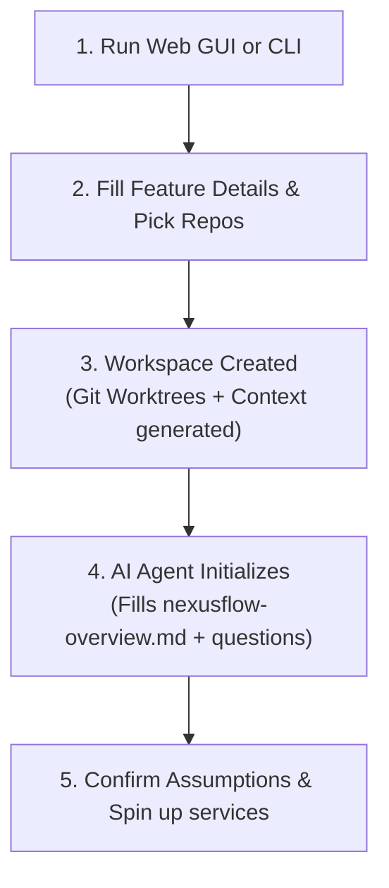

# NexusFlow — Getting Started Guide

Welcome to **NexusFlow**! This guide will walk you through the system, explain its core workflows, and show you how to leverage multi-repository workspaces and agentic orchestration to accelerate feature development.

---

## 💡 What is NexusFlow?

When developing complex features in modern systems, you often need to touch multiple repositories simultaneously (e.g., modifying a shared package, updating a backend REST API, and updating a frontend application). 

Traditional AI assistant setups only give the assistant context of a single repository. NexusFlow solves this by:
1. **Grouping Repositories**: Creating a dedicated workspace using **git worktrees** on a unified feature branch name.
2. **Generating AI Context**: Writing specialized configurations (`CLAUDE.md`, `AGENTS.md`, Copilot guidelines, and Cursor rules) that outline the workspace architecture.
3. **Smart Codebase Analysis**: Scanning tech stacks, ports, and API endpoints so the AI instantly understands the codebase boundaries.
4. **Service Orchestration**: Running, stopping, and logging all projects simultaneously from a single place.

---

## 🚀 Step-by-Step Workflow

Here is how to get started with your first feature workspace.



### 1. Initialize NexusFlow
First, initialize the default configuration on your machine:
```bash
nexusflow init
```
This sets up `~/.nexusflow/config.json` with default settings:
* **Development Directory**: Where your git repositories are located (defaults to `~/dev`).
* **Workspaces Directory**: Where your worktrees will be created (defaults to `~/dev/workspaces`).

---

### 2. Launch the Web Dashboard
NexusFlow comes with a rich, interactive Web Dashboard. Launch it by running:
```bash
nexusflow ui
```
This starts the local backend server on port `3000` and automatically opens the browser.

---

### 3. Create a Feature Workspace
On the dashboard (or via the `nexusflow create` CLI command):
1. **Branch name**: Enter your branch name (e.g. `feature/user-profiles`). Slashes are supported!
2. **Description**: Describe the feature you are building. The AI assistant will read this to compile the plan.
3. **Pick Repositories**: Choose which repositories you need to modify or reference.
4. **Assistant Selection**: Select which AI coding assistants you plan to use (Claude Code, Antigravity, Cursor, etc.).
5. **Click Build Workspace**: NexusFlow will fetch origin updates, create local branches, spin up git worktrees under `workspaces/feature/user-profiles`, run tech analyses, and write context configurations.

---

### 4. The Agentic Initialization (Universal Context)
Once the workspace is built, open it in your preferred AI assistant. 

Whichever AI harness you use, **the agent's very first instructions** are to:
1. Scan the workspace projects.
2. Create a universal reference file: **`nexusflow-overview.md`**.
3. Write down its assumptions of what each project does, how they interact, and their responsibilities.
4. List any **Clarifying Questions** it needs you to answer before coding.

**Your Action**: Review the generated `nexusflow-overview.md`, answer the assistant's questions directly in the chat or file, and confirm its assumptions. This ensures you and the agent are aligned before a single line of code is modified.

---

### 5. Orchestrate Local Services
You don't need to open five terminal windows to start your backend, frontend, databases, or libraries.

**On the Web Dashboard:**
* Expand your active workspace to see all detected services (e.g. node scripts, dotnet servers, python hosts).
* Click **Start All** to spin them up.
* View aggregate console streams inside the tabbed retro-terminal output screen.

**Via the CLI:**
* Navigate to your workspace directory and run:
  ```bash
  nexusflow start
  ```
* Check logs or stop services with:
  ```bash
  nexusflow logs
  nexusflow stop
  ```

---

## 🛠️ CLI Reference

Here is a summary of the command-line interface:

| Command | Usage | Description |
| :--- | :--- | :--- |
| **`nexusflow ui`** | `nexusflow ui [-p <port>]` | Starts the backend Hono API server and opens the GUI Dashboard. |
| **`nexusflow create`** | `nexusflow create` | Launches the interactive step-by-step terminal wizard to build a workspace. |
| **`nexusflow list`** | `nexusflow list` / `nexusflow ls` | Lists all active feature workspaces discovered on your machine. |
| **`nexusflow open`** | `nexusflow open` | Prompts you to pick an active workspace and opens it in your editor. |
| **`nexusflow start`** | `nexusflow start [path]` | Starts background processes for all projects in the workspace. |
| **`nexusflow stop`** | `nexusflow stop [path]` | Kills all running processes for the workspace. |
| **`nexusflow logs`** | `nexusflow logs [path] [-n <lines>]` | Tails output log files for all service processes in the workspace. |
| **`nexusflow status`** | `nexusflow status [path]` | Displays running/stopped statuses and PIDs for each service. |
| **`nexusflow init`** | `nexusflow init` | Creates or edits the global config file. |
