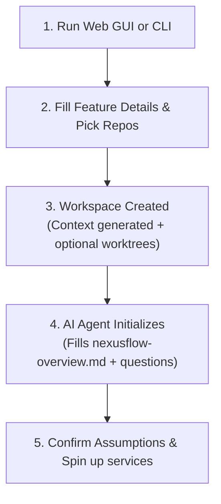

# NexusFlow — Getting Started Guide

Welcome to **NexusFlow**! This guide will walk you through the system, explain its core workflows, and show you how to leverage multi-repository workspaces and agentic orchestration to accelerate feature development.

---

## 💡 What is NexusFlow?

When developing complex features in modern systems, you often need to touch multiple repositories simultaneously (e.g., modifying a shared package, updating a backend REST API, and updating a frontend application). 

Traditional AI assistant setups only give the assistant context of a single repository. NexusFlow solves this by:
1. **Grouping Repositories**: Creating a dedicated workspace from ad-hoc repos or a registered project, using isolated **git worktrees** or in-place source repositories.
2. **Generating AI Context**: Writing specialized configurations (`CLAUDE.md`, `AGENTS.md`, Copilot guidelines, and Cursor rules) that outline the workspace architecture.
3. **Smart Codebase Analysis**: Scanning tech stacks, ports, and API endpoints so the AI instantly understands the codebase boundaries.
4. **Service Orchestration**: Running, stopping, and logging all projects simultaneously from a single place.

---

## 🚀 Step-by-Step Workflow

Here is how to get started with your first feature workspace.



### 1. Initialize NexusFlow
First, initialize the default configuration on your machine:
```bash
nexusflow init
```
This sets up `~/.nexusflow/config.json` with default settings:
* **Development Directory**: Where your git repositories are located (defaults to `~/dev`).
* **Workspaces Directory**: Where worktree workspaces are created; in-place workspace directories hold only the manifest and generated AI context files (defaults to `~/dev/workspaces`).

---

### 2. Launch the Web Dashboard
NexusFlow comes with a rich, interactive Web Dashboard. Launch it by running:
```bash
nexusflow ui
```
This starts the local backend server on port `3000` and automatically opens the browser.

---

### 3. Create a Feature Workspace
Via the `nexusflow create` CLI command:
1. **Repo Source**: Choose a registered project or continue with ad-hoc repo scanning.
2. **Work Mode**: Pick **Isolated worktrees** or **In-place**.
3. **Branch or Workspace Name**: Enter a feature branch for worktree mode (e.g. `feature/user-profiles`) or a workspace name for in-place mode.
4. **Description**: Describe the feature you are building. The AI assistant will read this to compile the plan.
5. **Assistant Selection**: Select which AI coding assistants you plan to use (Claude Code, Antigravity, Cursor, etc.).
6. **Finish the Wizard**: NexusFlow runs tech analyses and writes context configurations. In isolated worktree mode it also fetches origin updates, creates local branches, and spins up git worktrees under `workspaces/feature/user-profiles`.

#### Projects

A project is a named, persistent group of source repositories stored centrally in `~/.nexusflow/projects.json`. Project ids are slugified from the name (`Hogia Billing` becomes `hogia-billing`), and the command group also has the `proj` alias.

```bash
nexusflow project add -n "Hogia Billing" -r ../api ../frontend -d "Billing repos"
nexusflow project list      # alias: ls
nexusflow project show hogia-billing
nexusflow project remove hogia-billing -y  # alias: rm
```

The add flags are `-n/--name`, `-r/--repos <paths...>`, and `-d/--description`; omit `--repos` to use the interactive repo picker. Removing a project only edits the registry — it never deletes repositories or workspaces on disk, and `remove` accepts `-y/--yes`. The HTTP API exposes the same registry at `GET/POST /api/projects` and `PUT/DELETE /api/projects/:id`.

#### Work modes

| Mode | What happens |
| :--- | :--- |
| **Isolated worktrees** | The classic flow: a feature branch and git worktree per repo inside the workspace directory. |
| **In-place** | NexusFlow works directly in the source repositories. No branches or worktrees are created; the workspace directory holds only `nexusflow.json` and generated AI context files. |

In-place workspaces expect you to manage branches yourself: `nexusflow sync` is a deliberate no-op, `nexusflow finish` commits and pushes each repo's current branch, and PR/compare links are only offered when that branch differs from the default branch. `nexusflow list` tags them with `[in-place]`, deleting one never touches the source repositories, and agent sessions for single-repo in-place workspaces run in the repo root.

For API users, `POST /api/workspace` accepts optional `mode` (`worktree` default, or `in-place`), `name` (required for in-place), and `projectId`. Existing workspace manifests without a `mode` field are treated as `worktree` mode.

---

### 4. The Agentic Initialization (Universal Context)
Once the workspace is built, open it in your preferred AI assistant. 

Whichever AI harness you use, **the agent's very first instructions** are to:
1. Scan the workspace projects.
2. Create a universal reference file: **`nexusflow-overview.md`**.
3. Write down its assumptions of what each project does, how they interact, and their responsibilities.
4. List any **Clarifying Questions** it needs you to answer before coding.

**Your Action**: Review the generated `nexusflow-overview.md`, answer the assistant's questions directly in the chat or file, and confirm its assumptions. This ensures you and the agent are aligned before a single line of code is modified.

---

### 5. Orchestrate Local Services
You don't need to open five terminal windows to start your backend, frontend, databases, or libraries.

**On the Web Dashboard:**
* Expand your active workspace to see all detected services (e.g. node scripts, dotnet servers, python hosts).
* Click **Start All** to spin them up.
* View aggregate console streams inside the tabbed retro-terminal output screen.

**Via the CLI:**
* Navigate to your workspace directory and run:
  ```bash
  nexusflow start
  ```
* Check logs or stop services with:
  ```bash
  nexusflow logs
  nexusflow stop
  ```

### 6. Equip Reusable Agent Skills & Category Boxes
Equip your AI assistants with structured playbooks using the **Skills & Agents Hub**:
- Navigate to the **Skills & Agents** tab in the Web Dashboard.
- Browse built-in category templates (Pull Request review, Testing & QA, Cross-Repo package loop, Database migrations, Security audit).
- Drag and drop cards to re-categorize skills, create custom categories, or author new skills with Markdown playbooks and auxiliary scripts.
- Selectively enable or disable skills for your active workspace; when refreshed, NexusFlow automatically compiles and distributes them to `.agents/skills/`, `.claude/skills/`, `.cursor/rules/`, `.github/instructions/`, and `.codex/skills/`.

### 7. Capture Learnings as You Go
As you (or your AI assistant) make decisions and hit gotchas, record them so they aren't lost between sessions:
```bash
nexusflow knowledge add -t decision -m "Switched auth to short-lived tokens"
nexusflow knowledge add -t gotcha   -m "The worker needs REDIS_URL set locally"
```
Entries are filed under the right section of `nexusflow-knowledge.md` automatically. Your AI assistant can do the same through the `add_knowledge` MCP tool.

### 8. Finish the Feature
When the work is done, close the loop in one command:
```bash
nexusflow finish --dry-run          # preview: what will be committed / pushed
nexusflow finish -m "Ship feature"  # commit + push every repo, print PR links
```
`finish` shows a per-repo status table, commits and pushes each repo, and prints ready-to-open PR/compare links for each remote. In isolated worktree workspaces it uses the feature branches NexusFlow created; in-place workspaces use each repo's current branch and only offer PR/compare links when that branch differs from the default branch. It then offers to **promote** reusable learnings into each repo's persistent base knowledge, and — with `--cleanup` — removes the workspace once everything is safely pushed.


---

## 🛠️ CLI Reference

Here is a summary of the command-line interface:

| Command | Usage | Description |
| :--- | :--- | :--- |
| **`nexusflow ui`** | `nexusflow ui [-p <port>]` | Starts the backend Hono API server and opens the GUI Dashboard. |
| **`nexusflow create`** | `nexusflow create` | Launches the interactive wizard to build a worktree or in-place workspace. |
| **`nexusflow list`** | `nexusflow list` / `nexusflow ls` | Lists all active feature workspaces, tagging in-place ones with `[in-place]`. |
| **`nexusflow open`** | `nexusflow open` | Prompts you to pick an active workspace and opens it in your editor. |
| **`nexusflow start`** | `nexusflow start [path]` | Starts background processes for all projects in the workspace. |
| **`nexusflow stop`** | `nexusflow stop [path]` | Kills all running processes for the workspace. |
| **`nexusflow logs`** | `nexusflow logs [path] [-n <lines>]` | Tails output log files for all service processes in the workspace. |
| **`nexusflow status`** | `nexusflow status [path]` | Displays running/stopped statuses and PIDs for each service. |
| **`nexusflow init`** | `nexusflow init` | Creates or edits the global config file. |
| **`nexusflow project`** | `nexusflow project add` / `list` / `show` / `remove` | Manages registered repo groups (alias: `proj`). |
| **`nexusflow diff`** | `nexusflow diff` | Displays pending code changes across all active workspace repositories. |
| **`nexusflow commit`** | `nexusflow commit` | Automates cross-repository git commit and branch pushes in the workspace. |
| **`nexusflow sync`** | `nexusflow sync` | Syncs and rebases worktree-mode workspaces; deliberate no-op for in-place workspaces. |
| **`nexusflow finish`** | `nexusflow finish [-m <msg>] [--cleanup] [--dry-run]` | Closes out a feature: commits & pushes all repos, opens PRs / prints compare links, promotes learnings, and optionally removes the workspace. |
| **`nexusflow knowledge`** | `nexusflow knowledge add -t <type> -m <msg>` / `show` / `promote` | Captures workspace learnings and promotes reusable ones into per-repo base knowledge. |
| **`nexusflow refresh`**| `nexusflow refresh` | Regenerates architecture maps, task plans, and AI context files. |
| **`nexusflow doctor`** | `nexusflow doctor` | Assesses and reports diagnostics of the current workspace setup. |
